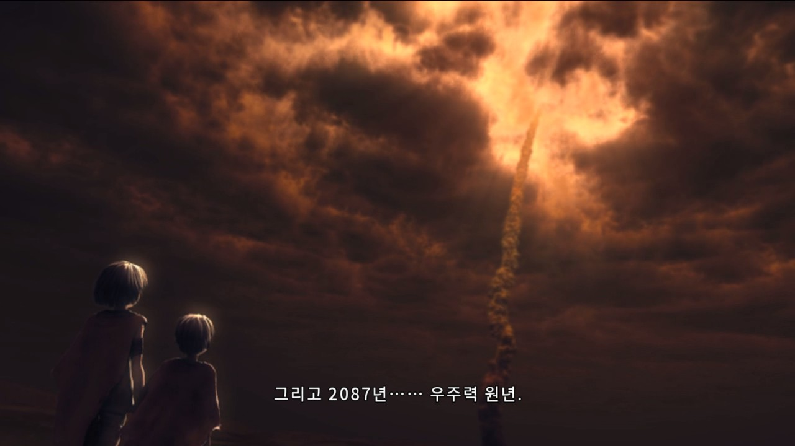
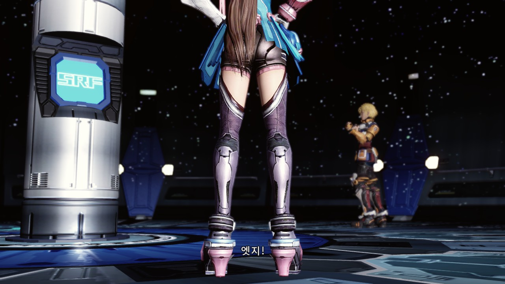
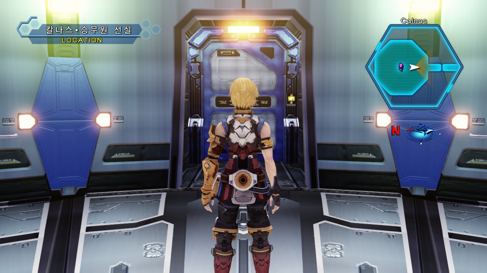
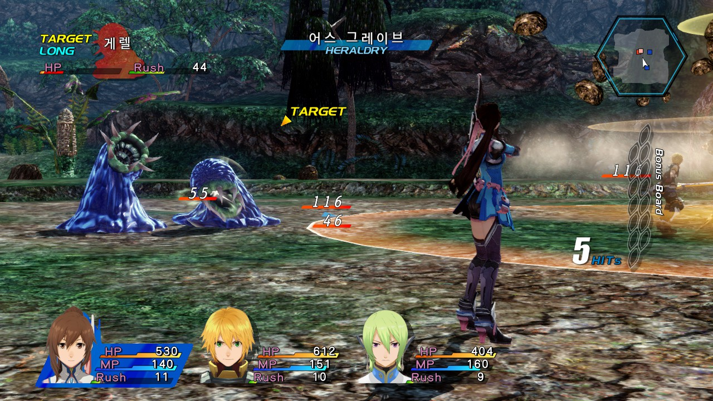

# 스타오션4 한글 패치

## 개요

스팀 및 xbox360의 스타오션4 한글패치를 제공하는 프로그램입니다.

## 샘플 이미지

  
   
  
  

## 패치 내용
* 일본어를 한글로 번역
* 캐릭터 이름 고정 및 이름 변경 기능 삭제
* 치트 지원
  * 이동 속도 2배
  * 전투 종료시마다 자동 회복
  * 세이브 제한 해제
    * 오동작 할 수 있습니다. 세이브 포인트에서 저장한 데이터도 필히 유지하세요.

## 패치 방법

### 스팀
* 게임이 설치된 폴더를 드래그 & 드롭 합니다.
* 원하는 치트를 선택하세요.
* [한글 패치] 버튼을 눌러 패치를 진행 합니다.
  * 패치시 생성된 복구 데이터를 보관하시면 이후 버전 업데이트시에도 원본으로 복원하지 않고, 바로 패치가 가능합니다.

### xbox360
* iso 원본파일 3개를 드래그 & 드롭 합니다.
* 원하는 치트를 선택하세요.
* [한글 패치] 버튼을 눌러 패치를 진행 합니다.
* 원본 경로에 _repacked 가 붙여져 생성됩니다.
* 재패치시에는 원본파일이 필요합니다.

## 요구사항
* Windows 10 이상

## 알려진 문제점
* xenia로 구동시 간혈적으로 화면이 어두워지는 문제가 있습니다.
  * 원본롬도 동일하게 발생하는 문제입니다.

## 다운로드

**[릴리즈 페이지](../../releases)** 에서 다운로드하세요.

본 패치를 다운로드하거나 사용하는 경우 아래의 면책조항 및 이용안내를 확인하고 이에 동의한 것으로 간주합니다.

## 면책조항

본 프로젝트는 비영리 목적의 팬 번역 프로젝트이며, 원작의 저작권은 해당 권리자에게 있습니다.

본 프로젝트는 게임 데이터, 실행 파일 또는 기타 저작권이 있는 원본 데이터를 포함하거나 배포하지 않습니다.

패치를 사용하려면 사용자가 합법적으로 취득한 원본 게임이 필요합니다.

프로젝트 운영자는 본 패치의 사용으로 인해 발생하는 어떠한 손해나 문제에 대해서도 책임을 지지 않습니다.

권리자의 요청이 있을 경우 본 프로젝트는 관련 자료의 공개를 중단하거나 삭제하는 등 필요한 조치를 취할 수 있습니다.

## 라이선스

이 프로젝트는 MIT License를 따릅니다. 자세한 내용은 LICENSE 파일을 참고해 주세요.

Copyright (c) 2026 Gideon

## Third-Party Software

* 이 프로젝트는 NotoSansKR-OFL 폰트를 사용하고 있습니다.

* This product includes software developed by in <in@fishtank.com>.

자세한 내용은 'docs/THIRD_PARTY_NOTICES' 디렉터리를 참고해 주세요.

---

Developed with GPT-6
